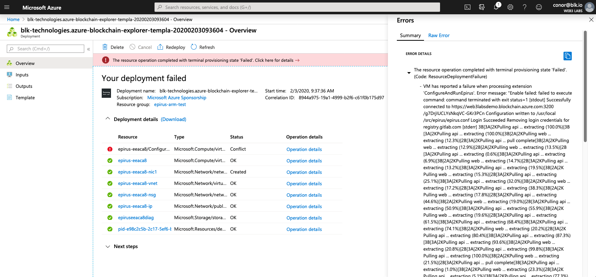

# Frequently Asked Questions

## Where can I get support?

Please [email us](mailto:support@web3labs.com) with your query and a member of our team will come back to you promptly.

## Is it possible to customise Epirus?

Yes, its possible to customise numerous parts of Epirus, including the logos, colors and currency that users see. Please [email us](mailto:support@web3labs.com) for more information.
    
## Where can I find the Epirus URL on Azure?

Please head to the [Getting Started](getting_started.md#azure) section for instructions.
    
## Are you hiring?
    
Please head to our [jobs portal](https://angel.co/company/web3labs/jobs) for current listings.

## How can I manage users credentials in Epirus on AWS?

On the host, you can use the `passwd` command to add or update user credentials.

``` shell
$ sudo epirus passwd <username>
New password: <enter password>
Re-type new password: <re-enter password>
Updating password for user <username>
```

## Error: `Unable to create instance on Azure - your deployment failed`

Due to a timeout issue, provisioning of Epirus has failed on Azure on some occasions.

If you hit this issue, you will see the following error:



The specific message is:

``` shell
epirus.service failed because the control process exited with error code.
```

To resolve the error, you will need to logon to the host that was created. To do this, click on the virtual machine name:


Then copy the DNS name of the host:


Logon to the host by running:

``` shell
ssh -i ~/.ssh/<private-key> epirus@<hostname>.<region>.cloudapp.azure.com
```

Then run the following to start Epirus manually:

``` shell
sudo systemctl start epirus.service
```

Epirus should start, and if you head to the hostname in your browser, you should see the Epirus loading screen:


After a few minutes you should see Epirus has started successfully:


## Error: `Unable to create instance on Azure - the template deployment is not valid`


``` shell
The template deployment 'blk-technologies.azure-blockchain-explorer-templa-20190701100047' is not valid according to the validation procedure. The tracking id is '494a6331-33c6-4c13-8871-359117dfa70b'. See inner errors for details. Please see https://aka.ms/arm-deploy for usage details.
```

Check that the instance name that you have used is globally unique. Using a common name such as `test` in the below example will fail:


If this does not resolve your issue, please [email us](mailto:support@web3labs.com) with details of the parameters you're trying to use.

## Epirus Explorer is stuck on the loading page

Please ensure that you are using the correct node endpoint. To verify it, you can run the following command:

``` shell
curl -X POST --header "Content-Type: application/json" --data '{"jsonrpc":"2.0","method":"web3_clientVersion","params":[],"id":1}' https://<node-url>
```

If you get a response like the following then you have configured the correct endpoint.

``` shell
{"jsonrpc":"2.0","id":1,"result":"Geth/v1.8.12-stable/linux-amd64/go1.10.8"}
```

## Error: I'm trying to upload a contract metadata file but it's failing
    
Please refer to the [Contract Registry](metadata.md) documentation.
