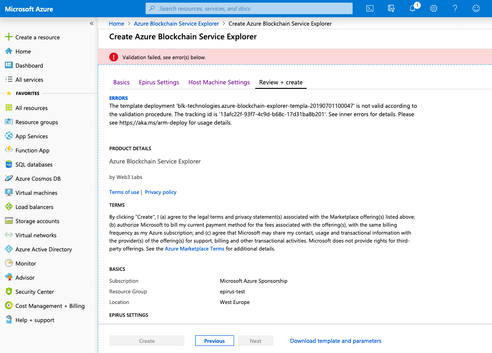
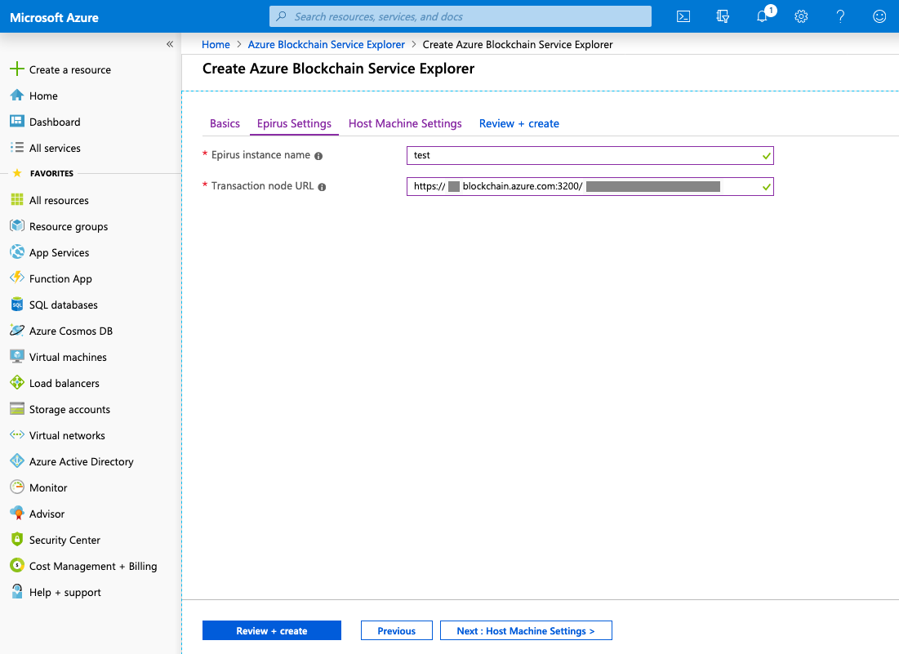

# Frequently Asked Questions

??? info "Where can I get support?"
    Please [email us](mailto:support@web3labs.com) with your query and a member of our team will come back to you promptly.

??? info "Is it possible to customise Epirus?"
    Yes, its possible to customise numerous parts of Epirus, including the logos, colors and currency that users see. Please [email us](mailto:support@web3labs.com) for more information.
    
??? info "Where can I find the Epirus URL on Azure?"
    Please head to the [Getting Started](getting_started.md#azure) section for instructions.
    
??? info "Are you hiring?"
    Please head to our [jobs portal](https://web3labs.workable.com/) for current listings.

??? info "How can I manage users credentials in Epirus on AWS?"
    On the host, you can use the `passwd` command to add or update user credentials.

    ```
    $ sudo epirus passwd <username>
    New password: <enter password>
    Re-type new password: <re-enter password>
    Updating password for user <username>
    ```

??? warning "Unable to create instance on Azure - the template deployment is not valid"
    
    
    ```
    The template deployment 'blk-technologies.azure-blockchain-explorer-templa-20190701100047' is not valid according to the validation procedure. The tracking id is '494a6331-33c6-4c13-8871-359117dfa70b'. See inner errors for details. Please see https://aka.ms/arm-deploy for usage details.
    ```

	Check that the instance name that you have used is globally unique. Using a common name such as `test` in the below example will fail:

	

	If this does not resolve your issue, please [email us](mailto:hi@web3labs.com) with details of the parameters you're trying to use.

??? warning "Epirus is stuck on the loading page"
    Please ensure that you are using the correct node endpoint. To verify it, you can run the following command:
    
    ```
    curl -X POST --header "Content-Type: application/json" --data '{"jsonrpc":"2.0","method":"web3_clientVersion","params":[],"id":1}' https://<node-url>
    ```
    
    If you get a response like the following then you have configured the correct endpoint.
    
    ```
    {"jsonrpc":"2.0","id":1,"result":"Geth/v1.8.12-stable/linux-amd64/go1.10.8"}
    ```

??? warning "I'm trying to upload a contract metadata file but it's failing"
    Please refer to the [Contract Registry](metadata.md) documentation.
