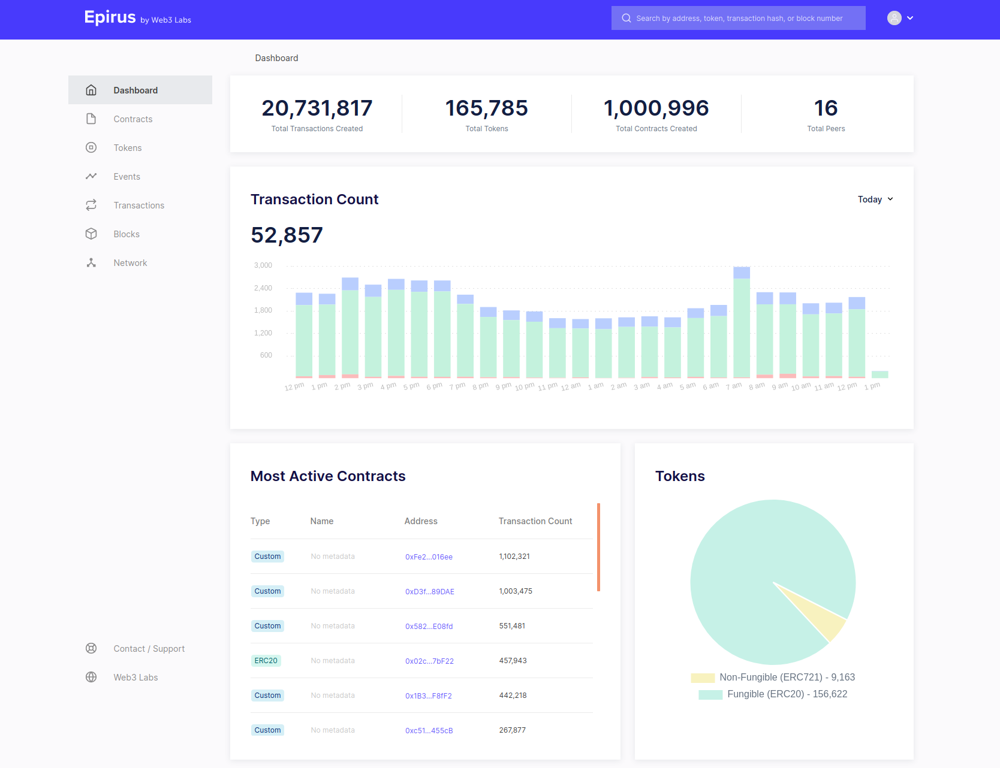
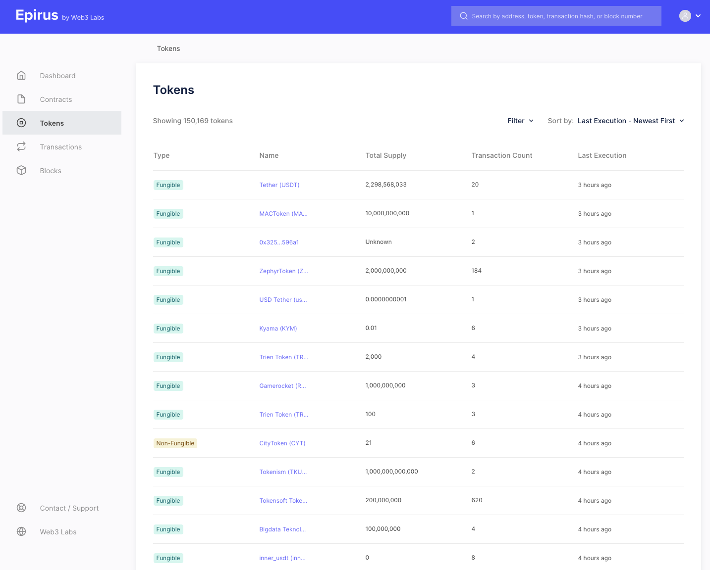
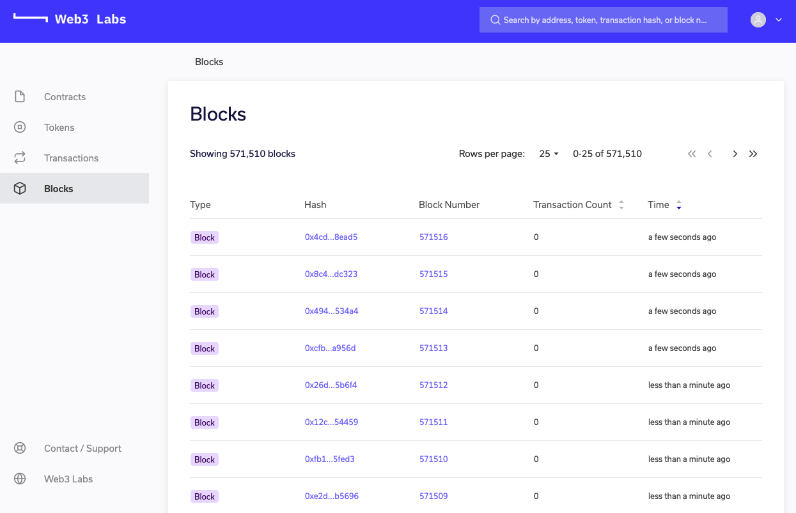
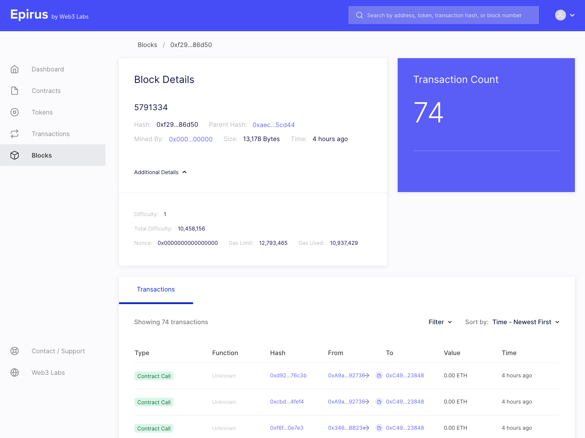

# Features

Epirus provides an intuitivie user experieince, driven by the menu on the left-hand side of the screen. Clicking on the relevent menu item will take you to the associated page.

## Dashboard

The Epirus dashboard provides a summary of key metrics of the blockchain contracts, including:

- Total transctions and token contracts
- Graphical transaction count broken down by transaction type (contract creation, contract transaction, currency transfer)
- Most active contracts
- Fungible (ERC20) versus non-fungible token contracts (ERC721)

## Tokens

The tokens view provides a view of all tokens deployed in the network, with separate labels for 
fungible or non-fungible tokens following the [ERC20](http://eips.ethereum.org/EIPS/eip-20) and [ERC721](http://eips.ethereum.org/EIPS/eip-721) Ethereum standards respectively.

If we click on one of our tokens, we get more information about it (as in the Contracts view).

Here you can see the attributes of the token.

You can also see details of the transfer events that have taken place for that token.

## Contracts

The contracts view displays all contracts that have been deployed to your network.

Here you can see details of all contracts deployed to the network. Those contracts that comply with well defined interfaces are automatically tagged with a type in the `Label` column to reflect this. For example, `ERC20` for fungible token contracts, `ERC721` for non-fungible token contracts, and Custom for those that have not been registered in the contract registry.

The `Name` column provides the contract name if the contract is registered in the Epirus contract registry. To learn more about the contract registry, head [here](metadata.md).

When you click on a contract, you are taken into the contract details page which has various information about the contract.

Here you can see details of all transactions associated with the contract and events emmitted by these transactions. If the contract is registered in the registry, events and their parameter names and values will be decoded.

Private transactions are labelled with a `Private` label. They will only be decipherable if the node that the Epirus instance is connected to is privy to the transaction.

## Transactions

The Transactions view provides the details of individual transactions, including private transactions when supported by your blockchain.

When you vieiw a transaction details you will be able to view lower-level details, such as the input byte code, which is available under the `Additional Details` menu.

## Blocks

The blocks view provides details of all blocks being generated on the network. As with the transactions view, technical details are available here too under the `Additional Details` menu.

Here you can see detailsi such as the block difficulty and gas consumed.

## Accounts

Clicking on an address that is not associated with a smart contract, i.e. it holds Ether, will bring up the account view, which displays the current balance and transactions associated with the account.

## Search

The search box in the top-right corner of the screen allows you to search by various criteria, including:

- Contract address
- Account address
- Transaction hash
- Block hash

If a match is found the associated contract, account, transaction or block details will be displayed.

## Advanced sorting and filters

Another key feature is the addition of sorting and filters in Epirus. This enables our users to 
find very active contracts by sorting their various views by key attributes. Contracts can be 
sorted by transaction date, transaction count or event contracts by transaction count.

The filters provided also allow you to view subsets of the available data, such as only 
displaying contract creation transactions or fungible tokens in the Tokens view.

