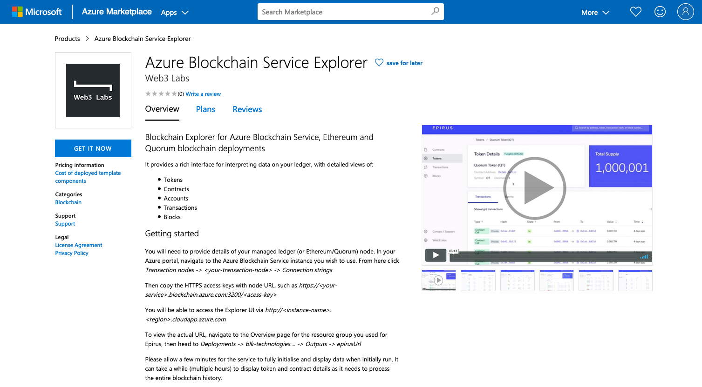
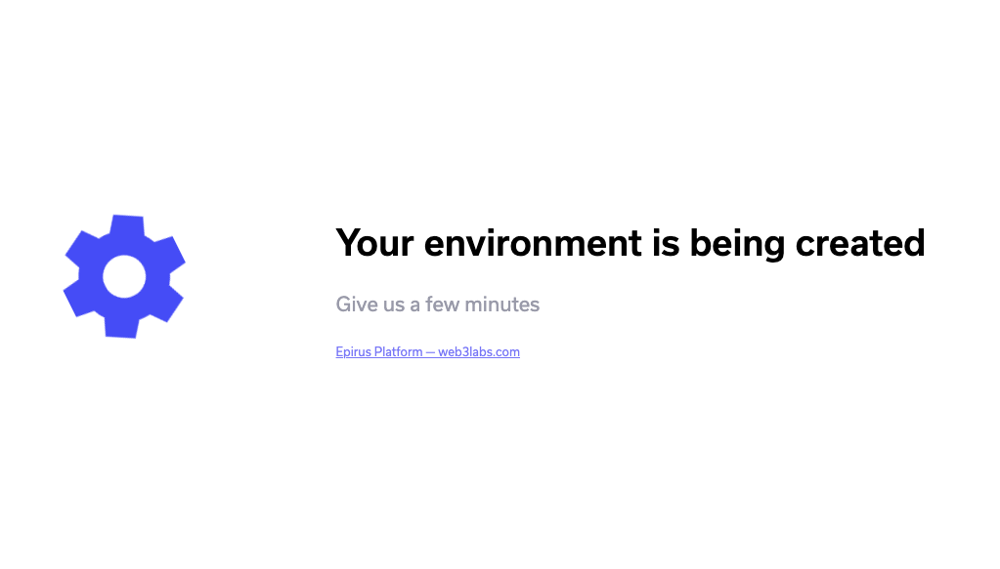
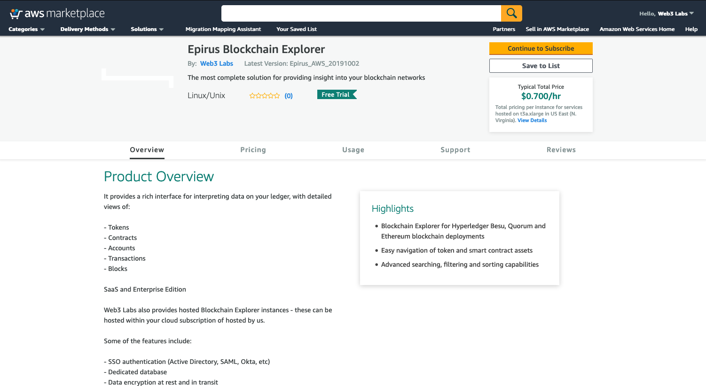

# Getting Started

Epirus supports a number of different hosting options which all come with support from the Web3 Labs team:

1. Cloud - you can find it in the [AWS](https://web3labs.com/aws-offer) and [Azure](https://web3labs.com/azure-offer) marketplaces
1. SaaS - we also provide a hosted or on-premise [Enterprise](#enterprise) version

There is also a basic [Free](#free) version.

This documentation reflects the features of our AWS, Azure and Enterprise versions.

## Azure

The [Azure Marketplace offer](https://web3labs.com/azure-offer) is the simplest full version of Epirus 
to get up and running with. It requires an active Azure cloud subscription



You will need to provide details of your managed ledger (or Ethereum/Quorum/Hyperledger Besu) node. In your Azure portal, navigate to the Azure Blockchain Service instance you wish to use. From here click `Transaction nodes -> <your-transaction-node> -> Connection strings`

Then copy the HTTPS access keys with node URL, such as `https://<your-service>.blockchain.azure.com:3200/<acess-key>`

You will be able to access the Explorer UI via `http://<instance-name>-<uuid>.<region>.cloudapp.azure.com`

To view the actual URL, navigate to the Overview page for the resource group you used for Epirus, then head to `Deployments -> blk-technologies.... -> Outputs -> epirusUrl`.

Please allow a few minutes for the service to fully initialise and display data when initially run. You will see the below loading screen while it is initially loading.



Please note, it can take a while (multiple hours) to display token and contract details as it needs to process the entire blockchain history.

## AWS

The [AWS Marketplace offer](https://web3labs.com/aws-offer) provides a pre-configured VM with 
Epirus already installed. It requires an active AWS subscription.



You will need to provide details of the RPC endpoint for your Hyperledger Besu/Quorum/Ethereum node. 

Copy the RPC endpoint for your node, such as `http://<your-service-url>:8545` (the default RPC port is 8545). This is the same URL you use to attach a console to your node - i.e. `geth attach http://<your-service-url>:8545` (for more information, head [here](https://github.com/ethereum/wiki/wiki/JSON-RPC#json-rpc-endpoint)).

Once the virtual machine has been deployed, launch a terminal on the machine:

```console
ssh -i <keyfile> ubuntu@<machine name>
```

Then copy the HTTPS access keys with node URL, such as `http://<your-service-url>`

Once the virtual machine has been deployed, launch a terminal on the machine. Then run the following command to configure the node (**please note AWS requires authentication credentials to be configured**):

```console
$ sudo epirus setup
Configuring Epirus instance

Please enter a username: <enter username>
New password: <enter password>
Re-type new password: <re-enter password>
Adding password for user <username>

Please enter node URL: http://<your-service-url>
Successfully connected to http://<your-service-url>
Configuration written to /usr/local/src/epirus/epirus.conf

You can then start the Epirus service:

$ sudo systemctl start epirus.service
```

You will be able to access the Explorer UI via `http://vm-ip-address-or-hostname`, providing the authentication credentials you specified when prompted.

Please allow a few minutes for the service to fully initialise and display data when initially run. It will automatically start up on subsequent reboots.


Please note, it can take a while (multiple hours) to display token and contract details as it needs to process the entire blockchain history.

If you need to modify or create additional access credentials, you can use the following command:

```console
sudo epirus passwd <new or existing username>
```

## Enterprise

Web3 Labs also provides hosted Blockchain Explorer instances - these can be hosted within your cloud subscription or hosted by us.

Some of the features include:

- SSO authentication (Active Directory, SAML, Okta, etc)
- Dedicated database
- Data encryption at rest and in transit
- Continuous backup and point in time data recovery
- Full access to backups
- Tableau integration support 

For further information please [email us](mailto:hi@web3labs.com). 


## Free 

A free, feature limited version of Epirus is available. This version is updated periodically, unlike the Azure and SaaS offerings which are constantly being updated with the latest features.

To get started with the free version, run the following command to download Epirus:

```bash
git clone https://github.com/blk-io/epirus-free.git
```

Navigate to the `epirus-free` directory directory and run the instance with:

```bash
cd epirus-free
NODE_ENDPOINT=http://<node_endpoint> docker-compose up
```

Note that if setting `NODE_ENDPOINT` to a local Ethereum instance, you may need to use the IP address associated with the Docker bridged interface, often denoted by `docker0`.

Append the `-d` argument to run the containers in the backgroud

You will be able to access the Explorer UI via:

[http://localhost](http://localhost/)

To stop the containers use:

```bash
docker-compose down
```

To connect to new network you should remove the volumes associated with the old network

```bash
docker-compose down -v
```

