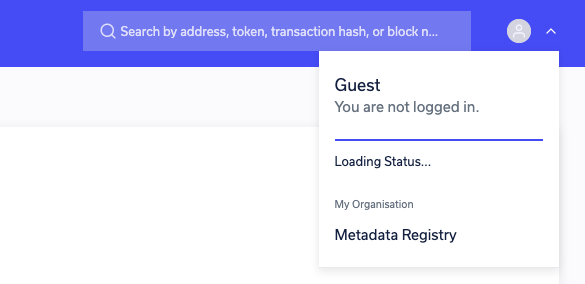

# Contract Metadata Registry

Epirus' integrated smart contract registry allows you to upload Solidity metadata files, which 
enables Epirus to display the name of contracts deployed to the network and all decode the 
names of all events and parameters that are emitted in transactions.

To use this functionality, you will need to generate a Solidity metadata file. Simply run 
`solc --metadata` when you compile your smart contract code to generate the file. The file 
you want to upload is typically called `<ContractName>_meta.json`.

There are two places that you can upload the metadata, in the contract view page under 
*Additional Details* by clicking the Upload link next to *Contract Metadata*, or by heading to the 
Metadata Registry itself, which you can access by clicking on the person icon in the top right 
corner.
   

From the registry you can view all of your contracts with associated metadata.

