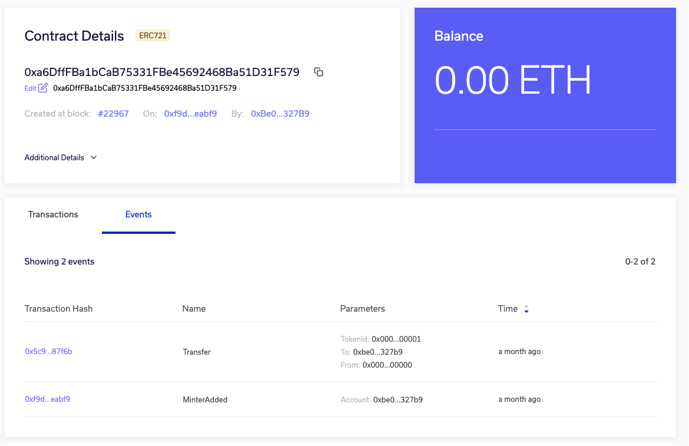
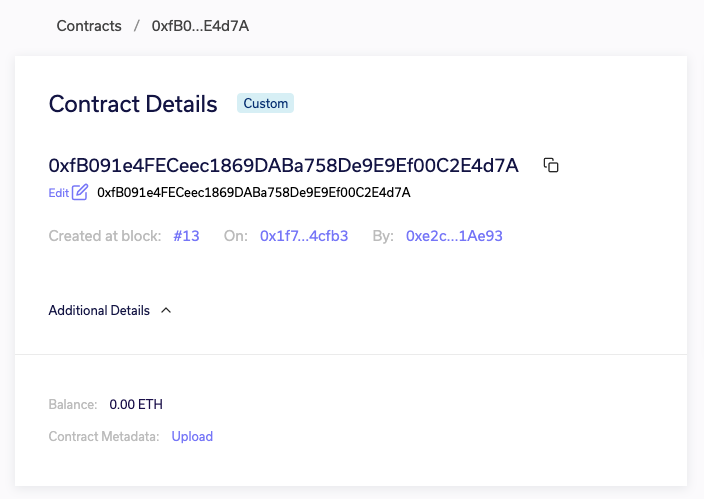
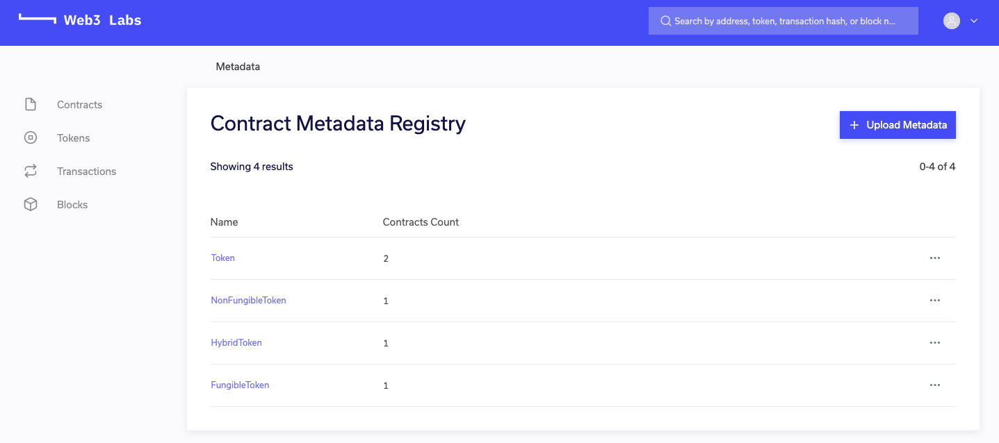
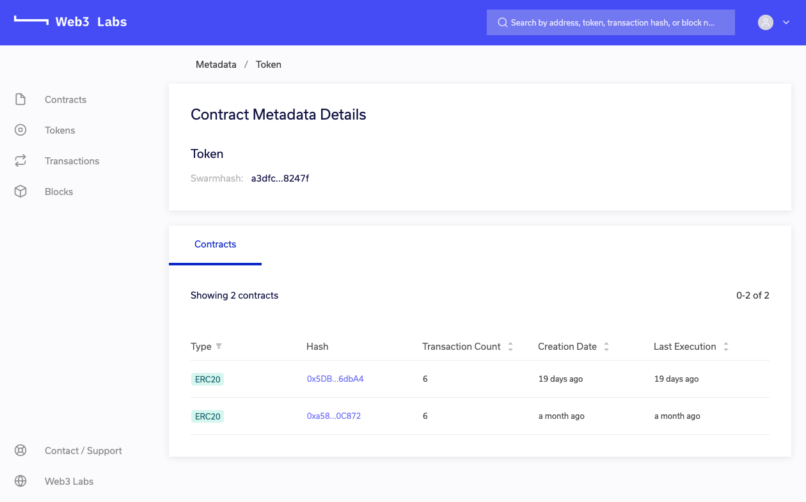

# Contract Metadata Registry

Epirus' integrated smart contract registry allows you to upload contract metadata files, which enables Epirus to provide far richer details about smart contracts and their associated transactions then would typically be possible in a blockchain network.

Additionally, Epirus will only successfully map a metadata file to a smart contract if the contract binary code contains a hash that matches the metadata file. This enables you to guarantee that smart contract code that was deployed to the network was created using the same source code as the metadata file. 
 
When present, it enables Epirus to display:

- The name of the contracts deployed to the network
- Decode the names of all events and parameters that are emitted in transactions

You can generate Solidity or Truffle metadata files via the following methods.

### Solidity

Run 
`solc --metadata` when you compile your smart contract code to generate the file. The file 
you want to upload is typically called `<ContractName>_meta.json`.

### Truffle

When you run `truffle compile` a `<Contract>.json` file is generated that contains various contract information.  Within this file in addition to the `abi` and `bytecode` entries there is a `metadata` field. If you put the metadata content into a json file you should be able to upload it.

### Metadata Upload

There are two places that you can upload the metadata, in the contract view page under 
`Additional Details` by clicking the `Upload` link next to `Contract Metadata`.

Alternatively, you can head to the 
Metadata Registry itself, which you can access by clicking on the person icon in the top right 
corner.
   

From the registry you can view all of your contracts with associated metadata.

By clicking on one of the metadata file names, you will be taken to a view of all contracts associated with that metadata file.

