# Mobile Experience

Epirus provides a fully responsive user experience. Although primarily intended for using with a desktop computer or laptop, we designed a great mobile experience too.

The mobile experience makes available all of the core functionality of the explorer such as the token, contract, address, transaction and block views along with all of the filtering and searching functionality.

## Navigation

Navigation is performed via the menu at the bottom of the screen.

## Contracts

As with the desktop version youur point of entry is the contracts view.

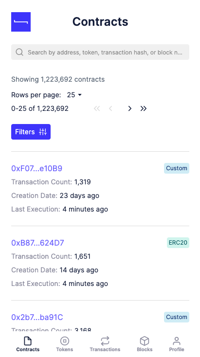

Clicking on a contract takes you to the contract details.

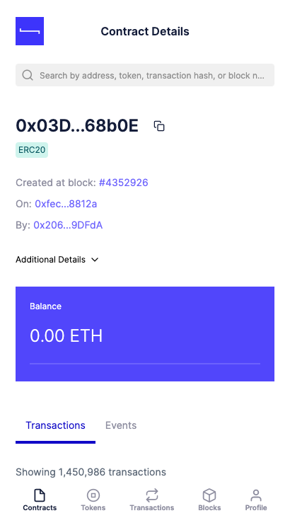

## Filtering and sorting

You also have sorting and filters available for all of your list views.

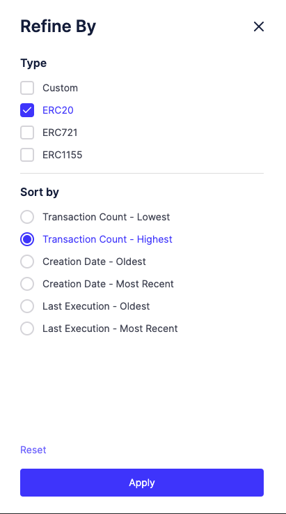

This allows you to sort for instance by the most active ERC20 contracts.

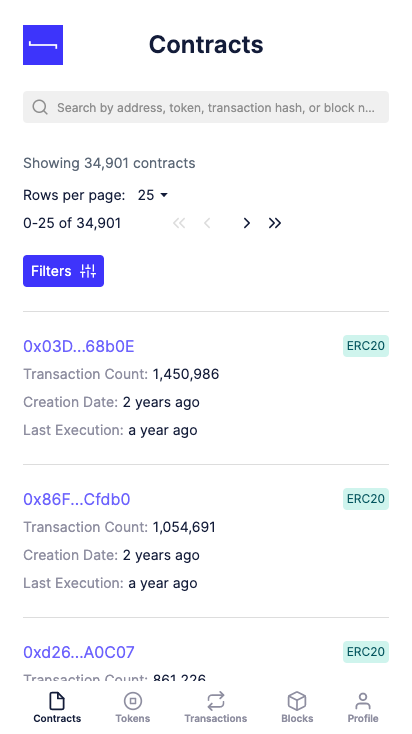

## Tokens

Navigating to the tokens page we have all tokens listed.

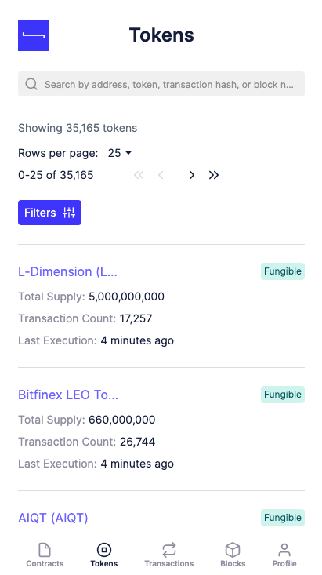

Where we can view individual token details.

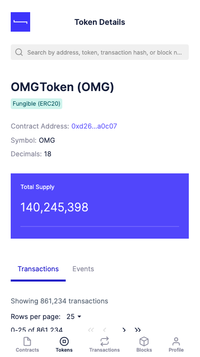

## Accounts

We also can view balances associated with accounts when we browse to an account which is associated with an Ethereum wallet, i.e. not a smart contract address.

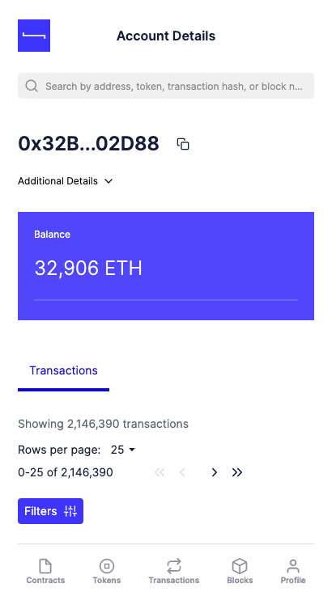

## Transactions

The transactions view lists all transactions.

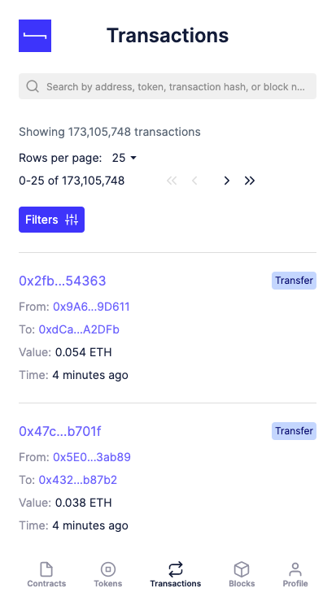

Clicking on a transaction provides the transaction details.

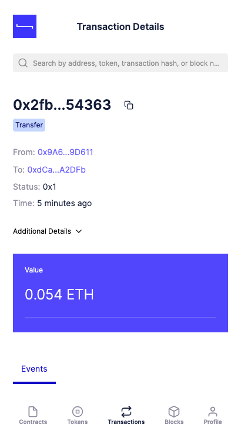

## Blocks

Likewise the blocks view lists all blocks.

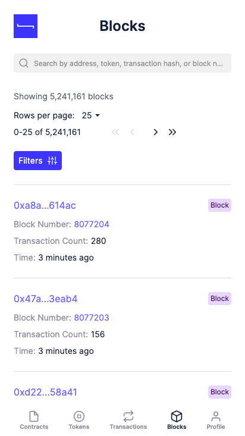

Again, clicking on a block provides the block details with associated transactions.

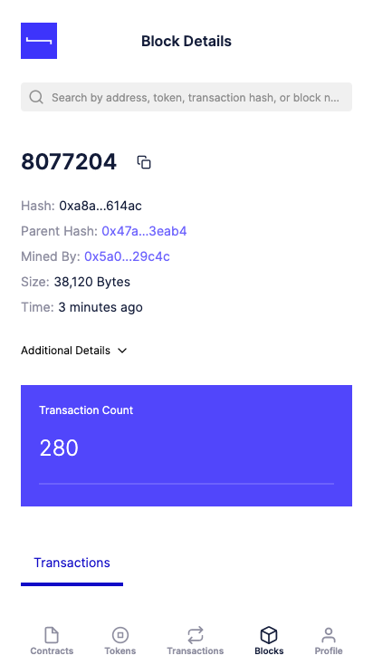

## Profile

Finally, the Profile view allows you to see the sync status of the network and browse to the contract registry.

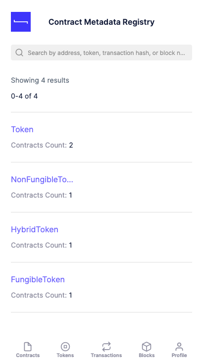
