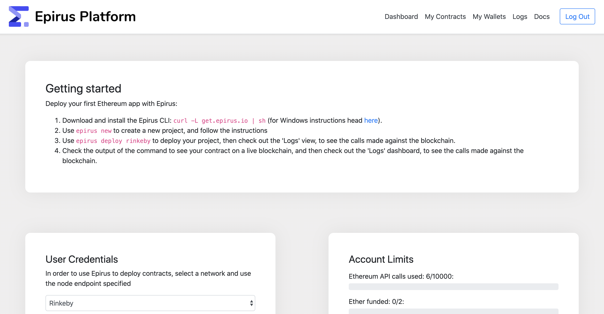
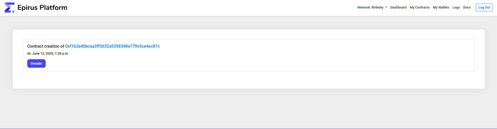
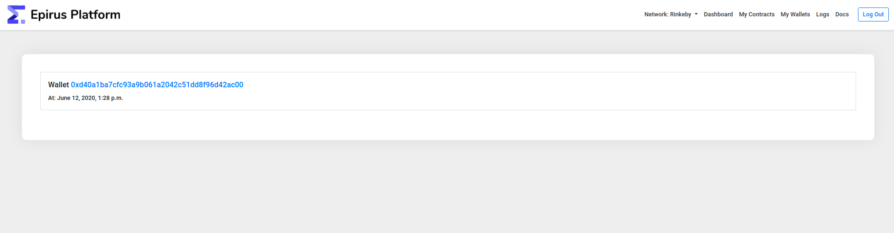

# Features

The Epirus portal is designed to help you track your blockchain resource usage, driven by the menu on the top side of the screen. 
Clicking on the relevant menu item will take you to the associated page.

## Dashboard

The Epirus portal dashboard provides a summary of key account metrics:

- Total Ethereum API calls
- Total Ether funded
- RPC endpoints for supported networks

## My Contracts

The contracts page provides a view of all contracts deployed in the network, with a link to the contract in the Epirus explorer.

## My Wallets

The wallets page provides a view of all of the Ethereum accounts associated with your Epirus account. 

## Logs

The logs page provides a raw view of all of the API calls made by Epirus that interact with your wallets.

