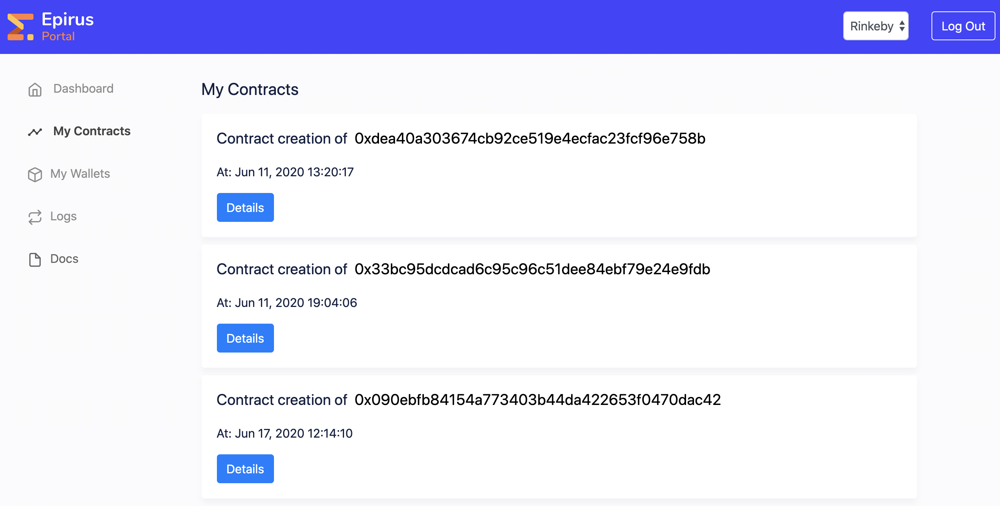
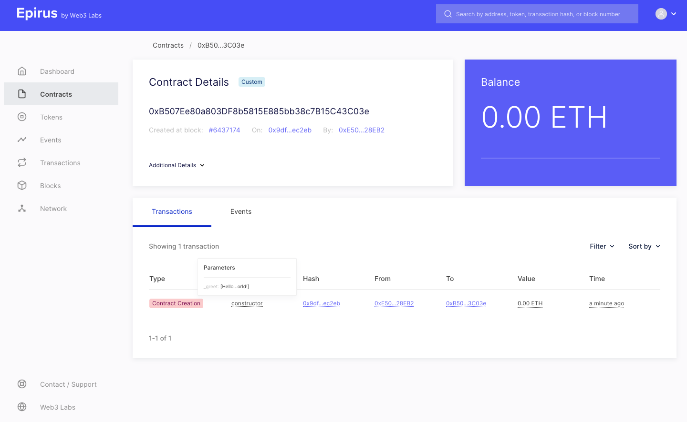

# QuickStart

The Epirus Platform consists of a suite of tools and services to enable rapid and efficient development, deployment and monitoring of blockchain applications.

All it takes is three commands to go from zero to having your first live blockchain application:

1. Install the Epirus SDK
1. Create your first applicaiton
1. Run your application against a live public network

Read on to super-charge your blockchain journey!

## Installation

To install the Epirus CLI run the following command in your terminal:

<CodeSwitcher :languages="{shell:'Mac/Linux',powershell:'Windows'}">
<template v-slot:shell>

``` shell
curl -L get.epirus.io | sh && source ~/.epirus/source.sh
```

</template>
<template v-slot:powershell>

``` powershell
Set-ExecutionPolicy Bypass -Scope Process -Force; iex ((New-Object System.Net.WebClient).DownloadString('https://raw.githubusercontent.com/epirus-io/epirus-installer/master/installer.ps1'))
```

</template>
</CodeSwitcher>


Alternatively, you can head [here](https://github.com/epirus-io/epirus-cli/releases/latest) to download the latest release.

## Project Creation

After having created a new account, use the command `epirus new` to create a new Hello World blockchain application for Ethereum. Epirus will use sensible defaults for all the questions asked during the project setup process, so if you hit enter on each question, the output should be similar to the following:

``` shell
$ epirus new
  ______       _                
 |  ____|     (_)               
 | |__   _ __  _ _ __ _   _ ___ 
 |  __| | '_ \| | '__| | | / __|
 | |____| |_) | | |  | |_| \__ \
 |______| .__/|_|_|   \__,_|___/
        | |                     
        |_|                     
[ / ] Creating and building project ... Subsequent builds will be faster

Project Created Successfully

Commands
./gradlew test                          Test your application
epirus run rinkeby|ropsten              Runs your application
epirus docker run rinkeby|ropsten       Runs your application in a docker container
```

Epirus has now created and built a full project, which includes a *Hello World* smart contract, and all the necessary code to interact with it, test it, and run it. 

Alternatively, if you'd like to try a more advanced option, you can run:

``` shell
$ epirus openapi new erc777
```

This will create an OpenAPI service for deploying and managing ERC777 compliant tokens on the Ethereum network.
Other alternatives, such as ERC20 contracts, will be discussed below.

Check the [Web3j-OpenAPI](https://docs.web3j.io/web3j_openapi) documentation for more information.

## Account Creation

If you wish to make use of the more powerful features of Epirus such as its node connectivity and transaction fee management, you will need to sign up for a free account via the [Epirus website](https://www.web3labs.com/epirus).

Once your email address has been confirmed, you will have an account on the Epirus platform and will be able to make use of all features.

You will need to be logged in to deploy Epirus applications. Use `epirus login` and follow the prompt to do this.

## Deployment

Using the `epirus run` command, you will be able to run your application against the Rinkeby and Ropsten Ethereum test networks.

This application will transact with the network via a local wallet that Epirus generated for you, the wallet will automatically be funded with testnet Ether by Epirus when you deploy and transact with your application contract.

Connectivity to the relevant network is also provided by Epirus.

``` shell
$ epirus run rinkeby
  ______       _                
 |  ____|     (_)               
 | |__   _ __  _ _ __ _   _ ___ 
 |  __| | '_ \| | '__| | | / __|
 | |____| |_) | | |  | |_| \__ \
 |______| .__/|_|_|   \__,_|___/
        | |                     
        |_|                     
Preparing to run your Web3App

Account status      ACTIVE 
Wallet balance      0.0984925612 ETH
Uploading metadata  DONE

Running your Web3App

Contract address    https://rinkeby.epirus.io/contracts/0xa12dda51eac72ffd6dc4f9ccc6fb6bbdd8b97892
Wallet address      https://rinkeby.epirus.io/accounts/0x1f17c4af8313f5923a05b1dc6c262bb0b9c90c27
```

Once completed you can use the provided links to examine your live blockchain application and account!

If you created an OpenAPI service, you will be able to access it via <http://localhost:9090/swagger-ui>.

## Containerised deployment

Epirus also provides containerised deployment, packaging up the application into a Docker image. This is achieved via the `epirus docker` command.

### Building a container

To build a new Docker image, use `epirus docker build` in your project directory:

``` shell
$ epirus docker build
  ______       _                
 |  ____|     (_)               
 | |__   _ __  _ _ __ _   _ ___ 
 |  __| | '_ \| | '__| | | / __|
 | |____| |_) | | |  | |_| \__ \
 |______| .__/|_|_|   \__,_|___/
        | |                     
        |_|                     
Sending build context to Docker daemon  80.19MB
Step 1/8 : FROM ubuntu as Build
 ---> bb0eaf4eee00
Step 2/8 : COPY . /root/app
 ---> Using cache
 ---> d026d00a2b22
Step 3/8 : RUN apt-get update && apt-get install -y 	curl bash openjdk-11-jre 	&& rm -rf /var/cache/apk/* 	&& curl -L get.epirus.io | sh 	&& /root/.epirus/epirus 	&& cd /root/app 	&& ./gradlew generateContractWrappers
 ---> Using cache
 ---> 29dc085b698c
Step 4/8 : FROM alpine
 ---> a24bb4013296
Step 5/8 : COPY --from=Build /root /root/
 ---> Using cache
 ---> 871dbb346cb2
Step 6/8 : RUN apk add --no-cache bash openjdk11-jre	&& rm -rf /var/cache/apk/* 	&& mkdir /opt/app
 ---> Using cache
 ---> 012de0ea89e4
Step 7/8 : WORKDIR /root/app
 ---> Using cache
 ---> 0f75612f7a98
Step 8/8 : ENTRYPOINT ["/root/.epirus/epirus", "run", "rinkeby"]
 ---> Using cache
 ---> 0b206554fa1e
Successfully built 0b206554fa1e
Successfully tagged web3app:latest
```

Once built, you can run your container using the `epirus docker run <network>` command.

### Running locally

Use the `-l` (local) parameter to run the container using the default wallet file configured for Epirus (`~/.epirus/.config`):

``` shell
epirus docker run -l <network>
```

### Running externally

To run in an external environment, such as a Kubernetes cluster, you will need to ensure that the credentials used by the project are defined - transaction fees will still be maintained by Epirus.

To do so, you can either specify a wallet via defining the following variable: 

- `WEB3J_WALLET_PATH`
  Path to Ethereum wallet
- `WEB3J_WALLET_PASSWORD`
  Ethereum wallet password

Or use private key:

- `WEB3J_PRIVATE_KEY`
  Hex-encoded private key string (0x...) 
  
Same goes for running an OpenAPI service.

If you need to create a new wallet, you can use the `epirus wallet create` command. Further details are available [here](sdk/cli/#wallet-tools).

Then you can run the container as follows:

``` shell
epirus docker run <network>
```

## Running without an Epirus account

If you wish to run your Epirus applications without creating an Epirus account, you can use the Gradle, Java or Docker application runners to run them manually. However, you will need to provide environment variables or configuration parameters with details of the following configuration items:

- Ethereum wallet or private key
- Ethereum node endpoint

### Required properties

The below configuration properties can be used for Java, Kotlin or OpenAPI projects:

- `WEB3J_ENDPOINT`
  Ethereum node URL
- `WEB3J_PRIVATE_KEY`
  Hex-encoded private key string (0x...) 
- `WEB3J_WALLET_PATH`
  Alternatively, a wallet file can be provided
- `WEB3J_WALLET_PASSWORD`
  Password for the provided wallet file

You can refer to the instructions [here](/sdk/cli/#running-your-application-without-an-epirus-account) for further details.

## Monitoring

Monitoring your application is achieved via the Epirus Explorer. 

You can login to the [Epirus Portal](https://portal.epirus.io/contracts) to see details of the contracts you have deployed. 



From here you can navigate to the Epirus Explorer for information about the transaction associated with your contracts.



There will be a single transaction which was the transaction that deployed your contract.

If you hover over the `constructor` field you will see the Hello World message that was in your smart contract that has now been deployed to the globally decentralized public Ethereum network!


The other view provides details of all transactions associated with your recently created wallet file. This was created when you ran the `epirus new` command, and funded with the cryptocurrency Ether when you ran `epirus run` as the created project deploys a real Hello World smart contract when it runs. This funding activity allows you to pay for transactions on the public Ethereum network.


Finally, click on the Dashboard link in Epirus Explorer to see an overview of the public Ethereum network your contract was deployed to.


You can learn more about the Epirus Explorer [here](/explorer).

## Next Steps

From here you'll probably want to start digging further through the project code created by the Epirus SDK and experimenting with some of the other CLI options. Read more [here](/sdk/cli).
