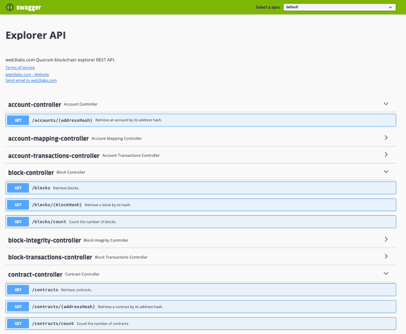

# REST API

Epirus provides a RESTful API which can be used for bespoke reporting. 

To access the Swagger docs for the API, which allow you to easily query the API, head to 
`<your-instance-url>/api`. 

Swagger also makes it straight forwards to test API queries.

This API makes available all data you see in the user interface. This, combined with the 
filtering functionality and the contract registry, allows you to easily create custom reports 
for your blockchain applications, such as details of all transfer events associated with a specific token.
