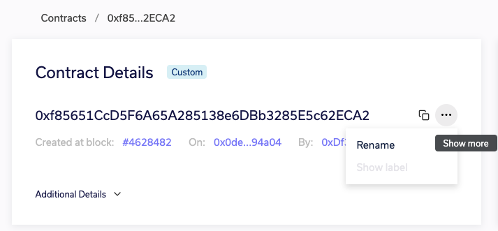
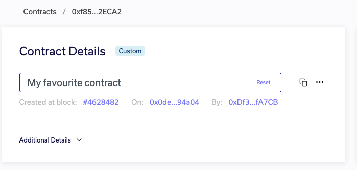
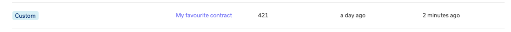
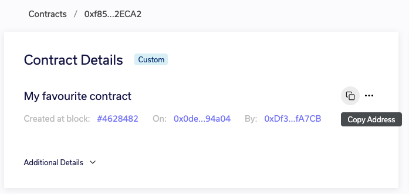

# Address Tagging

At Web3 Labs we're trying to eliminate all sources of complexity in the blockchain. Hexadecimal 
contract addresses are one such challenge. Now in Epirus, if you have a contract you'd like to 
give a human readable name, you can simply tag it with an alternate identifier.

When you're viewing a contract, if you hover over the ellipses (`...`) to the right of the 
address, you are given the option to add a tag.

Enter a name for the contract address in the text box.

And no more hex address is shown for the contract!

Don't worry, you can still easily access the contract address if you need to.

